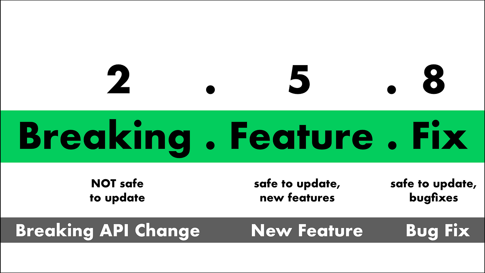

# Semantic Versioning POC

# ✨ **Why does software have version numbers?** ✨

- **Show progress**: e.g version 2.0.0 comes after version 1.0.0.

- **Marketing**: “Version 2.0.0 has 100 new features over version 1.0.0”

- **Compatibility**: That means that by looking at two version numbers for the same piece of software, a software developer can make a decision on how compatible these two versions are.

## Understand this workspace

Run `nx graph` to see a diagram of the dependencies of the projects.

## Run

`npx nx serve admin`

## Release a new version

`npm run semantic-release`
